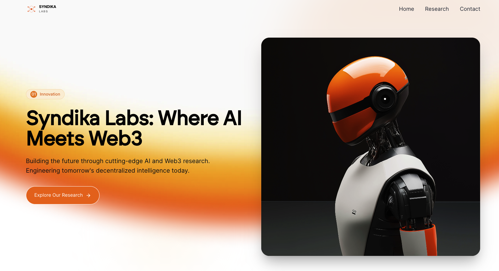

<div align="center">
  
  <br/>
  <em>Syndika Labs Homepage</em>
</div>

# Syndika Labs Homepage

Welcome to the official repository for the Syndika Labs homepage.

## About Syndika Labs

Syndika Labs is dedicated to building innovative products at the intersection of Artificial Intelligence and Blockchain technology. Our mission is to drive the future of decentralized and intelligent solutions, empowering individuals and organizations with cutting-edge tools and platforms.

## Features
- Modern, responsive homepage for Syndika Labs
- Showcases our AI and blockchain products
- Fast, optimized, and easy to maintain

## Tech Stack
- **Vite** – Lightning-fast frontend tooling
- **React** – Component-based UI library
- **TypeScript** – Typed JavaScript for reliability
- **Tailwind CSS** – Utility-first CSS framework
- **shadcn-ui** – Accessible, customizable UI components

## Getting Started

To run this project locally, follow these steps:

1. **Clone the repository**
   ```sh
   git clone <REPO_URL>
   cd syndikalabs-landing
   ```
2. **Install dependencies**
   ```sh
   npm install
   ```
3. **Start the development server**
   ```sh
   npm run dev
   ```
4. Open your browser and visit the local server URL (usually `http://localhost:5173`).

## Contributing

We welcome contributions! Please open an issue or submit a pull request for any improvements or suggestions.

## License

This project is licensed under the MIT License. See the [LICENSE](LICENSE) file for details.

## Contact

For more information, visit our website or reach out to us at [contact@syndikalabs.com](mailto:contact@syndikalabs.com).
